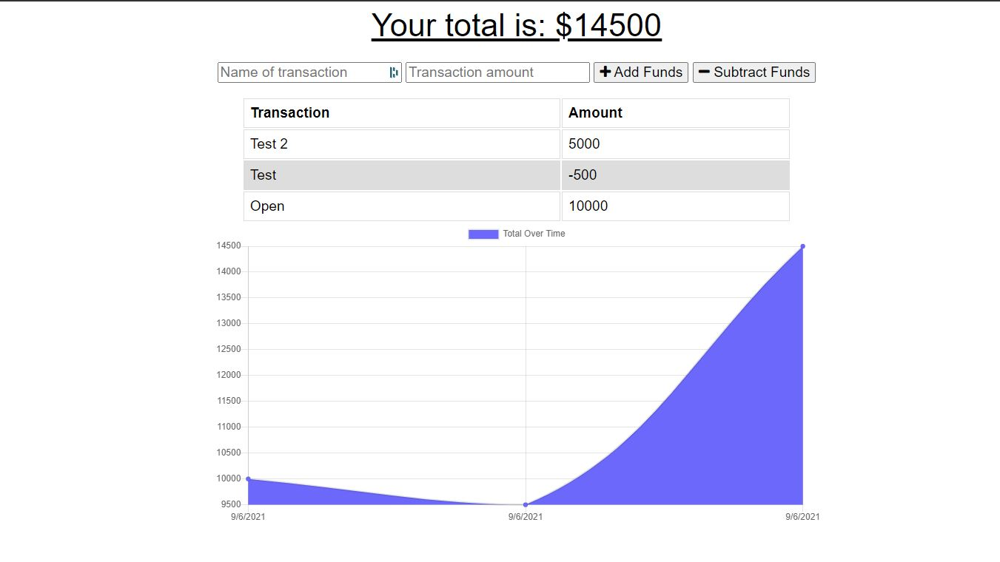

  # Budget Tracker

  ## **Description**
  Budget Tracker can accept transactions on or offline to keep track of incoming and outgoing funds. It can also be downloaded as a PWA to run like a native app.

  ## **Images**
  
  
  ## **Table of Contents**
  
  * [Installation](#dependencies)
  * [Usage](#usage)
  * [License](#license)
  * [Features](#features)
  * [Languages](#languages)
  * [Technology](#technology)
  * [Contribute](#contribute)
  
  ## **Installation**
  To install dependencies:

  npm i express, npm i mongoose, npm i connection, npm i morgan

  ## **Usage**
  install all dependencies and type 'node server' in the terminal. Or visit the deployed application (link below).

  ## **License**
  
   
  https://opensource.org/licenses/MIT
   

  ## **Features**
  The deployed application can be found at https://rocky-everglades-41665.herokuapp.com/ 

  ## **Languages**
   CSS, HTML, JavaScript, Node JS, Mongo DB

  ## **Technology**
  https://www.mongodb.com/

  https://mongoosejs.com/

  https://www.npmjs.com/package/compression

  https://www.npmjs.com/package/morgan

  https://www.npmjs.com/package/connection

  ## **Contribute**
  Find me on [GitHub](https://www.github.com/mattbisbee)
   
  Send me an [Email](mailto:aldhelm7@gmail.com)
   
  [Contributor Covenant](https://www.contributor-covenant.org/)
